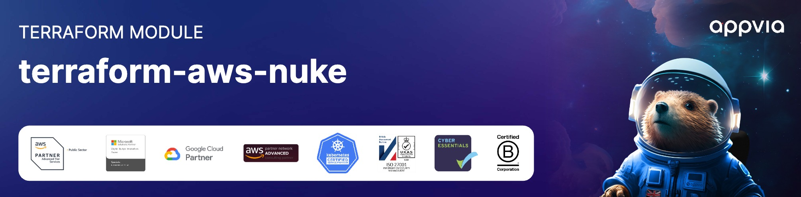

<!-- markdownlint-disable -->

<a href="https://www.appvia.io/"></a><br/><p align="right"> <a href="https://registry.terraform.io/modules/appvia/nuke/aws/latest"></a></a> <a href="https://github.com/appvia/terraform-aws-nuke/releases/latest"></a> <a href="https://appvia-community.slack.com/join/shared_invite/zt-1s7i7xy85-T155drryqU56emm09ojMVA#/shared-invite/email"></a> <a href="https://github.com/appvia/terraform-aws-nuke/graphs/contributors"></a>

<!-- markdownlint-restore -->
<!--
  ***** CAUTION: DO NOT EDIT ABOVE THIS LINE ******
-->


# Terraform Nuke Module

## Description

The purpose of this module is to provide a method of automated cleanup of resources, using the [aws-nuke](https://ekristen.github.io/aws-nuke/) tool. This module will create a scheduled task that will run an ECS task on a regular basis to clean up resources that are no longer needed.

It is intended to be used in a non-production environment, such as a development or testing account, to ensure that resources are not left running and incurring costs when they are no longer needed.

## Usage

The following provides an example of how to use this module:

```hcl
locals {
  tags = {
    "Environment" = "Sandbox"
    "GitRepo"     = "https://github.com/appvia/terraform-aws-nuke"
    "Owner"       = "Support"
    "Product"     = "Sandbox"
  }
}

module "vpc" {
  source  = "appvia/network/aws"
  version = "0.3.2"

  availability_zones     = 2
  enable_ipam            = false
  enable_transit_gateway = false
  name                   = "nuke"
  public_subnet_netmask  = 28
  tags                   = local.tags
  transit_gateway_id     = null
  vpc_cidr               = "172.16.0.0/25"
}

module "nuke" {
  source = "github.com/appvia/terraform-aws-nuke?ref=main"

  ## Indicates if the KMS key should be created for the log group
  create_kms_key = false
  ## Indicates if we should skips deletion (default is false)
  enable_deletion = false
  ## This is the location of the aws-nuke configuration file, this is
  ## copied into the container via a parameter store value
  nuke_configuration = "${path.module}/assets/nuke-config.yml.example"
  ## This will create a task that runs every day at midnight
  schedule_expression = "cron(0 0 * * ? *)"
  ## Name of the secret (AWS Secrets Manager) to store the configuration in
  configuration_secret_name = "sandbox/nuke"
  ## The ssubnet_ids to use for the nuke service
  subnet_ids = module.vpc.public_subnet_ids
  ## The tags for the resources created by this module
  tags = local.tags
}
```

## Update Documentation

The `terraform-docs` utility is used to generate this README. Follow the below steps to update:

1. Make changes to the `.terraform-docs.yml` file
2. Fetch the `terraform-docs` binary (https://terraform-docs.io/user-guide/installation/)
3. Run `terraform-docs markdown table --output-file ${PWD}/README.md --output-mode inject .`

<!-- BEGIN_TF_DOCS -->

## Requirements

| Name                                                                     | Version  |
| ------------------------------------------------------------------------ | -------- |
| <a name="requirement_terraform"></a> [terraform](#requirement_terraform) | >= 1.0.7 |
| <a name="requirement_aws"></a> [aws](#requirement_aws)                   | >= 5.0.0 |

## Providers

| Name                                             | Version  |
| ------------------------------------------------ | -------- |
| <a name="provider_aws"></a> [aws](#provider_aws) | >= 5.0.0 |

## Modules

| Name                                         | Source                        | Version |
| -------------------------------------------- | ----------------------------- | ------- |
| <a name="module_kms"></a> [kms](#module_kms) | terraform-aws-modules/kms/aws | 3.1.0   |

## Resources

| Name                                                                                                                                                         | Type        |
| ------------------------------------------------------------------------------------------------------------------------------------------------------------ | ----------- |
| [aws_cloudwatch_event_rule.current](https://registry.terraform.io/providers/hashicorp/aws/latest/docs/resources/cloudwatch_event_rule)                       | resource    |
| [aws_cloudwatch_event_target.current](https://registry.terraform.io/providers/hashicorp/aws/latest/docs/resources/cloudwatch_event_target)                   | resource    |
| [aws_cloudwatch_log_group.current](https://registry.terraform.io/providers/hashicorp/aws/latest/docs/resources/cloudwatch_log_group)                         | resource    |
| [aws_ecs_cluster.current](https://registry.terraform.io/providers/hashicorp/aws/latest/docs/resources/ecs_cluster)                                           | resource    |
| [aws_ecs_task_definition.task](https://registry.terraform.io/providers/hashicorp/aws/latest/docs/resources/ecs_task_definition)                              | resource    |
| [aws_iam_role.cloudwatch](https://registry.terraform.io/providers/hashicorp/aws/latest/docs/resources/iam_role)                                              | resource    |
| [aws_iam_role.execution](https://registry.terraform.io/providers/hashicorp/aws/latest/docs/resources/iam_role)                                               | resource    |
| [aws_iam_role.task](https://registry.terraform.io/providers/hashicorp/aws/latest/docs/resources/iam_role)                                                    | resource    |
| [aws_iam_role_policy.execution_secrets](https://registry.terraform.io/providers/hashicorp/aws/latest/docs/resources/iam_role_policy)                         | resource    |
| [aws_iam_role_policy.task_permissions](https://registry.terraform.io/providers/hashicorp/aws/latest/docs/resources/iam_role_policy)                          | resource    |
| [aws_iam_role_policy_attachment.cloudwatch](https://registry.terraform.io/providers/hashicorp/aws/latest/docs/resources/iam_role_policy_attachment)          | resource    |
| [aws_iam_role_policy_attachment.execution](https://registry.terraform.io/providers/hashicorp/aws/latest/docs/resources/iam_role_policy_attachment)           | resource    |
| [aws_iam_role_policy_attachment.task_permissions](https://registry.terraform.io/providers/hashicorp/aws/latest/docs/resources/iam_role_policy_attachment)    | resource    |
| [aws_secretsmanager_secret.configuration](https://registry.terraform.io/providers/hashicorp/aws/latest/docs/resources/secretsmanager_secret)                 | resource    |
| [aws_secretsmanager_secret_version.configuration](https://registry.terraform.io/providers/hashicorp/aws/latest/docs/resources/secretsmanager_secret_version) | resource    |
| [aws_caller_identity.current](https://registry.terraform.io/providers/hashicorp/aws/latest/docs/data-sources/caller_identity)                                | data source |
| [aws_iam_policy_document.cloudwatch](https://registry.terraform.io/providers/hashicorp/aws/latest/docs/data-sources/iam_policy_document)                     | data source |
| [aws_iam_policy_document.ecs_assume](https://registry.terraform.io/providers/hashicorp/aws/latest/docs/data-sources/iam_policy_document)                     | data source |
| [aws_iam_policy_document.execution_permissions](https://registry.terraform.io/providers/hashicorp/aws/latest/docs/data-sources/iam_policy_document)          | data source |
| [aws_iam_policy_document.secrets_manager](https://registry.terraform.io/providers/hashicorp/aws/latest/docs/data-sources/iam_policy_document)                | data source |
| [aws_region.current](https://registry.terraform.io/providers/hashicorp/aws/latest/docs/data-sources/region)                                                  | data source |

## Inputs

| Name                                                                                                                                    | Description                                                                                 | Type                                                  | Default                                                               | Required |
| --------------------------------------------------------------------------------------------------------------------------------------- | ------------------------------------------------------------------------------------------- | ----------------------------------------------------- | --------------------------------------------------------------------- | :------: |
| <a name="input_nuke_configuration"></a> [nuke_configuration](#input_nuke_configuration)                                                 | The YAML configuration to use for aws-nuke                                                  | `string`                                              | n/a                                                                   |   yes    |
| <a name="input_subnet_ids"></a> [subnet_ids](#input_subnet_ids)                                                                         | The subnet id's to use for the nuke service                                                 | `list(string)`                                        | n/a                                                                   |   yes    |
| <a name="input_tags"></a> [tags](#input_tags)                                                                                           | Map of tags to apply to resources created by this module                                    | `map(string)`                                         | n/a                                                                   |   yes    |
| <a name="input_assign_public_ip"></a> [assign_public_ip](#input_assign_public_ip)                                                       | Indicates if the task should be assigned a public IP                                        | `bool`                                                | `false`                                                               |    no    |
| <a name="input_configuration_secret_name"></a> [configuration_secret_name](#input_configuration_secret_name)                            | The name of the AWS Secrets Manager secret to store the configuration                       | `string`                                              | `null`                                                                |    no    |
| <a name="input_container_cpu"></a> [container_cpu](#input_container_cpu)                                                                | The amount of CPU to allocate to the container                                              | `number`                                              | `256`                                                                 |    no    |
| <a name="input_container_image"></a> [container_image](#input_container_image)                                                          | The image to use for the container                                                          | `string`                                              | `"ghcr.io/ekristen/aws-nuke"`                                         |    no    |
| <a name="input_container_image_tag"></a> [container_image_tag](#input_container_image_tag)                                              | The tag to use for the container image                                                      | `string`                                              | `"v3.26.0-2-g672408a-amd64"`                                          |    no    |
| <a name="input_container_memory"></a> [container_memory](#input_container_memory)                                                       | The amount of memory to allocate to the container                                           | `number`                                              | `512`                                                                 |    no    |
| <a name="input_create_kms_key"></a> [create_kms_key](#input_create_kms_key)                                                             | Indicates if a KMS key should be created for the log group                                  | `bool`                                                | `false`                                                               |    no    |
| <a name="input_enable_container_insights"></a> [enable_container_insights](#input_enable_container_insights)                            | Indicates if container insights should be enabled for the cluster                           | `bool`                                                | `false`                                                               |    no    |
| <a name="input_enable_deletion"></a> [enable_deletion](#input_enable_deletion)                                                          | Indicates the scheduled task will dry-run, log and report but not delete resources          | `bool`                                                | `false`                                                               |    no    |
| <a name="input_kms_administrator_role_name"></a> [kms_administrator_role_name](#input_kms_administrator_role_name)                      | The name of the role to use as the administrator for the KMS key (defaults to account root) | `string`                                              | `null`                                                                |    no    |
| <a name="input_kms_key_alias"></a> [kms_key_alias](#input_kms_key_alias)                                                                | The alias to use for the nuke KMS key                                                       | `string`                                              | `"nuke"`                                                              |    no    |
| <a name="input_log_group_kms_key_id"></a> [log_group_kms_key_id](#input_log_group_kms_key_id)                                           | The KMS key id to use for encrypting the log group                                          | `string`                                              | `null`                                                                |    no    |
| <a name="input_log_group_name"></a> [log_group_name](#input_log_group_name)                                                             | The name of the log group to create                                                         | `string`                                              | `null`                                                                |    no    |
| <a name="input_log_retention_in_days"></a> [log_retention_in_days](#input_log_retention_in_days)                                        | The number of days to retain logs for                                                       | `number`                                              | `7`                                                                   |    no    |
| <a name="input_schedule_expression"></a> [schedule_expression](#input_schedule_expression)                                              | The schedule expression to use for the event rule                                           | `string`                                              | `"cron(0 0 * * ? *)"`                                                 |    no    |
| <a name="input_task_role_additional_policies"></a> [task_role_additional_policies](#input_task_role_additional_policies)                | A map of inline policies to attach to the IAM role                                          | <pre>map(object({<br/> policy = string<br/> }))</pre> | `null`                                                                |    no    |
| <a name="input_task_role_permissions_arns"></a> [task_role_permissions_arns](#input_task_role_permissions_arns)                         | A list of permissions to attach to the IAM role                                             | `list(string)`                                        | <pre>[<br/> "arn:aws:iam::aws:policy/AdministratorAccess"<br/>]</pre> |    no    |
| <a name="input_task_role_permissions_boundary_arn"></a> [task_role_permissions_boundary_arn](#input_task_role_permissions_boundary_arn) | The boundary policy to attach to the IAM role                                               | `string`                                              | `null`                                                                |    no    |

## Outputs

| Name                                                                       | Description                                                          |
| -------------------------------------------------------------------------- | -------------------------------------------------------------------- |
| <a name="output_kms_key_arn"></a> [kms_key_arn](#output_kms_key_arn)       | The KMS key ARN used for the nuke service, if created                |
| <a name="output_kms_key_id"></a> [kms_key_id](#output_kms_key_id)          | The KMS key ID used for the nuke service, if created                 |
| <a name="output_secret_arn"></a> [secret_arn](#output_secret_arn)          | The ARN of the AWS Secrets Manager containing the nuke configuration |
| <a name="output_secret_arn_id"></a> [secret_arn_id](#output_secret_arn_id) | The ID of the AWS Secrets Manager containing the nuke configuration  |

<!-- END_TF_DOCS -->
